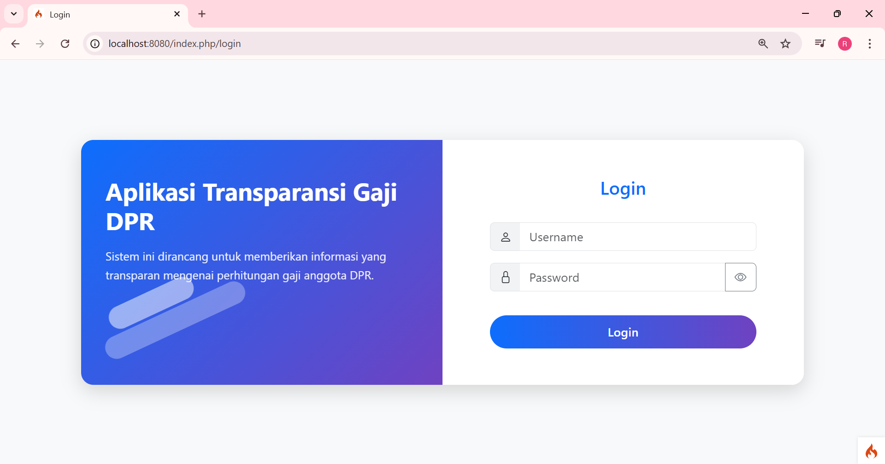
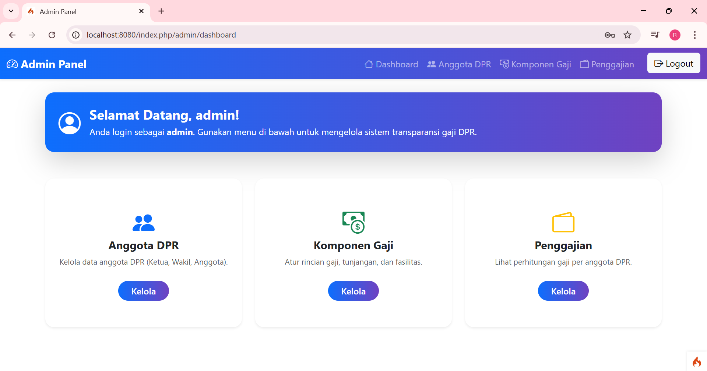
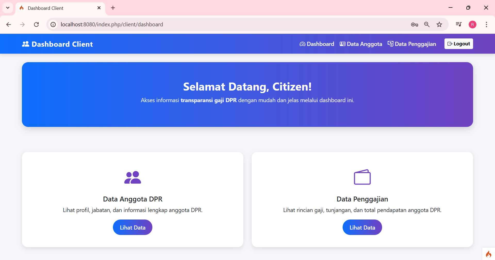

# Aplikasi Perhitungan dan Transparansi Gaji DPR

## Deskripsi Singkat

Aplikasi ini dirancang untuk mendukung transparansi keuangan anggota DPR dengan fitur utama pengelolaan data anggota, komponen gaji, dan penggajian. Sistem ini memiliki dua peran utama: **Admin** (pengelola data) dan **Client** (pengguna publik untuk melihat data secara transparan).

## Fitur Utama

* **Autentikasi**: Login untuk membedakan hak akses Admin dan Client.
* **Admin Panel**:

  * Kelola Data Anggota DPR.
  * Kelola Komponen Gaji (tunjangan, fasilitas, gaji pokok).
  * Kelola Data Penggajian (perhitungan otomatis Take Home Pay).
* **Client Panel**:

  * Lihat Data Anggota DPR.
  * Lihat Data Penggajian DPR.
* **Transparansi Data**: Menyediakan informasi gaji secara terbuka dan terstruktur.

## Teknologi yang Digunakan

* **Framework**: CodeIgniter 4
* **Frontend**: Bootstrap 5, Bootstrap Icons
* **Database**: MySQL
* **Bahasa Pemrograman**: PHP 8, HTML, CSS, JavaScript

## Tampilan Aplikasi

| Halaman          | Tautan                                 |
| ---------------- | -------------------------------------- |
| Halaman Login    |    |
| Dashboard Admin  |    |
| Dashboard Client |  |
